# jj — jump jump

Directory bookmarking for your terminal. Save spots, jump back instantly.

<p align="center">
  
</p>

## Install

### From release binaries

Download the binary for your platform from [Releases](https://github.com/Patrik-Stas/jj/releases), then:

```bash
chmod +x _jj-*
sudo mv _jj-* /usr/local/bin/_jj
```

### From source

Requires Go 1.21+.

```bash
git clone https://github.com/Patrik-Stas/jj.git
cd jj
make build
sudo make install
```

## Shell setup

Add to your `~/.zshrc`:

```bash
eval "$(_jj init zsh)"
```

Or for bash, add to `~/.bashrc`:

```bash
eval "$(_jj init bash)"
```

Restart your shell or `source` the file.

## Usage

```
jj save [name]    save current directory as a spot (default: dirname)
jj list [prefix]  list spots
jj remove <name>  remove a spot
jj <name>         jump to a spot
```

Tab completion works in both zsh and bash — type `jj my<tab>` and it completes. If multiple spots match, they're shown interactively, just like `cd`.

Prefix matching also works at runtime — if you have a spot called `myproject`, `jj my` jumps there directly (as long as it's unambiguous).

## How it works

A child process can't change the parent shell's working directory. So `jj` can't be just a binary — running `./jj foo` would `cd` inside the subprocess and exit, leaving your shell exactly where it was.

The solution is two layers:

1. **`_jj` binary** (Go, ~2.5MB static binary) — the backend. It manages the spot storage: save, list, remove, resolve names to paths, and provide completions. It also generates the shell integration code via `_jj init zsh|bash`.

2. **`jj` shell function** — injected into your shell by `eval "$(_jj init zsh)"`. This thin wrapper intercepts `jj <name>`, calls `_jj resolve <name>` to get the path, and runs `cd` in your actual shell session. Subcommands like `save`, `list`, and `remove` are passed through to the binary directly.

Spots are stored in `~/.jjspots` as a plain tab-separated file:

```
acmesrc	/users/john/ops/acme/src
logs	/var/log/nginx
myproject	/users/john/dev/myproject
```

No daemon. No database. No config directory. No dependencies.

## Supported platforms

- macOS (Apple Silicon + Intel)
- Linux (amd64 + arm64)
- zsh and bash

## License

MIT
